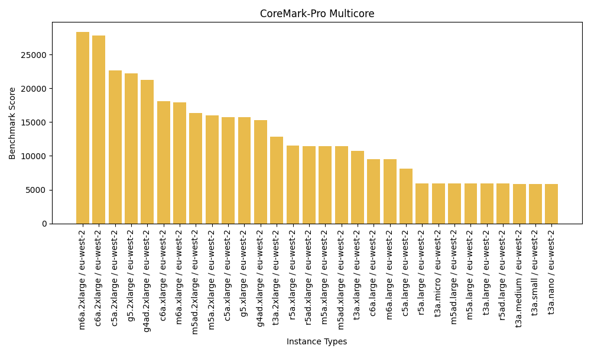

# Benchmark Template

The Benchmark example runs a Task consisting of a set of benchmarks on each VM instance that is provisioned.

The following benchmarks are included by default:

- **sysbench**: https://github.com/akopytov/sysbench (single-core, multicore, memory, and storage)
- **sysbench MySQL TPC-C**: https://github.com/Percona-Lab/sysbench-tpcc
- **CoreMark**: https://github.com/eembc/coremark.git (single-core and multicore)
- **CoreMark Pro**: https://github.com/eembc/coremark-pro.git (providing single-core and multicore results)
- **LINPACK**: https://people.sc.fsu.edu/~jburkardt/c_src/linpack_bench/linpack_bench.html

The benchmark steps are encapsulated in the [benchmarks.sh](benchmarks.sh) file.

At the conclusion of all benchmarks on all instances, a **summary** Task is run to collect the benchmark results into a consolidated CSV file, and to produce a graphical bar chart for each benchmark, an example of which is shown below:



Finally, a consolidated PDF report is produced containing all benchmark charts along with descriptive text.

## Prerequisites

Please see the top-level [`README`](../README.md) documentation.

## Usage

All `yd-` commands below should be run from within the `benchmark` directory.

### Configuration

Copy the supplied [config-template.toml](config-template.toml) file to a file called **`config.toml`**, then:

1. Populate the Application Key (`key`) and Application Secret (`secret`) properties
2. Populate the Template ID (`templateId`) property with the `ydid` ID of your chosen Compute Template

The **Compute Template** should be capable of provisioning the range of instances on which you want to run your the benchmarks. For example, a split-provisioned static Compute Template including five Compute Sources, each with a different instance type, will provision five different instances when provisioned with an instance count of five (`instances = 5`).

The Compute Template should specify the `yd/yellowdog/yd-agent-base` Image Family. Each instance will be prepared for running its benchmarks using the script in [userdata.sh](userdata.sh), prior to registering with its Worker Pool.

### Provision a Worker Pool

```shell
yd-provision
```

This will create a Worker Pool according to the specification in `config.toml`.

### Submit a Work Requirement

```shell
yd-submit
```

This submits a Work Requirement defined in [wr_benchmark.json](wr_benchmark.json) consisting of **`instances`** identical benchmark Tasks. The number of Tasks will match the number of provisioned nodes.

To follow the progress of a Work Requirement, use the `--follow` or `-f` option:

```shell
yd-submit --follow
```

When a Task is complete its output can be inspected in the Object Store.

#### Selecting Specific Benchmarks

By default, the full set of benchmarks is run, but it's possible to select a single benchmark or a subset of benchmarks by overriding the `benchmarks` variable in the TOML file, on the command line, or in the environment (using `YD_VAR_benchmarks`).

On the command line, this takes the form:

```shell
yd-submit -v benchmarks=sysbench,coremark-pro
```

The benchmark names that can be selected are:
- `sysbench`
- `mysql-tpcc`
- `coremark-standard`
- `coremark-pro`
- `linpack`

### Download the Results

```shell
yd-download
```

This will download the results of your Work Requirements to your local filesystem, in a directory named using the `namespace` property.

### Cancel Work Requirements

```shell
yd-cancel
```

This will cancel any of your Work Requirements that are still running.


### Shut Down the Worker Pool

```shell
yd-shutdown
```

This will shut down your Worker Pool(s). Note that Worker Pools will automatically shut down after being idle for the period of time specified in the `config.toml` file.

Alternatively, your Compute Requirements can be terminated immediately using:

```shell
yd-terminate
```

### Delete YellowDog Objects

```shell
yd-delete
```

This cleans up all of your objects in the YellowDog Object Store, using the `namespace` and `tag` for matching.
